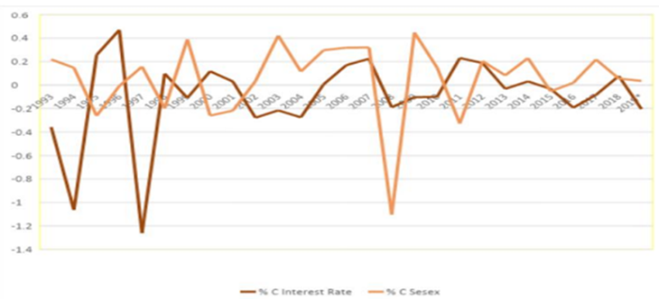
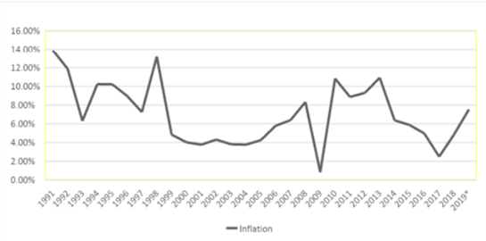

# Stock Market Analysis: Impact of Interest Rates and Inflation

## Overview
This project analyzes the relationship between interest rates, inflation, and stock market performance in India from 1991-2019. The research focuses on how monetary policy decisions by the Reserve Bank of India (RBI) influence market dynamics, with particular attention to the SENSEX and NIFTY indices.

## Key Findings

### Interest Rate Impact
- Negative correlation observed between interest rates and Indian stock indices
- SENSEX shows stronger sensitivity to interest rate changes compared to NIFTY
- Market reactions vary by sector with differential impacts across industries

### Inflation Analysis
- Moderate negative correlation between inflation and stock market performance
- Historical range: 10.2% (1991) to 4.4% (2000)
- NIFTY demonstrates higher sensitivity to inflation compared to SENSEX

## Data Visualization

### SENSEX vs Interest Rate Trend

*Figure 1: Correlation between SENSEX performance and interest rate changes (1991-2019)*

### Historical Inflation Trends

*Figure 2: Inflation rate fluctuations and their impact on market performance (1991-2000)*

## Mechanisms of Market Influence

### Direct Market Effects
- Cost of borrowing for companies
- Consumer spending patterns
- Corporate earnings impact
- Investment allocation decisions
- Sector-specific responses

### Stakeholder Implications

#### For Investors
- Portfolio diversification strategies
- Sector-specific investment considerations
- Market timing based on monetary policy

#### For Companies
- Financial planning optimization
- Investment strategy adjustment
- Debt management approaches

#### For Policymakers
- Economic stability considerations
- Market impact assessment
- Policy implementation guidelines

## Sectoral Analysis

### Technology Sector
- Strong performance during market volatility
- Digital transformation driving growth
- Notable performers: Infosys, TCS

### Pharmaceutical Sector
- Positive market response
- Healthcare demand influence
- Key players: Dr. Reddy's Laboratories, Cipla

## Recommendations

### For Investors
1. Maintain diversified portfolios
2. Monitor central bank announcements
3. Adjust strategies based on sector-specific impacts

### For Policymakers
1. Ensure monetary policy transparency
2. Provide clear guidance on rate trajectories
3. Balance economic stability with market impact

## Data Sources
- Historical market data (1991-2019)
- RBI monetary policy records
- Sectoral performance metrics

## Contributing
We welcome contributions to this analysis. Please review our contributing guidelines and submit pull requests for any enhancements.

## License
This project is licensed under the MIT License - see the LICENSE file for details.

## Contact
For questions or feedback about this research, please open an issue in this repository.